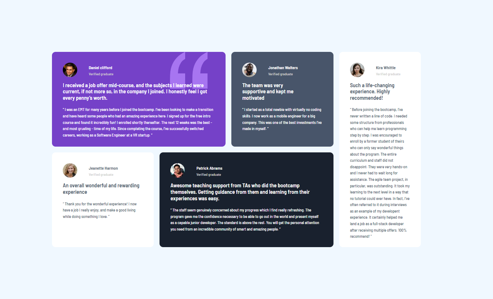

##Overview
This is an assignment by web3bridge, team 1, cohort vii.

###Challenge
> This is a challenge from Frontend Mentor. The challenge is to creat a grid testimonia using both css and html and make it look very close to the design.

###Screenshot

##My Process
###Built-with
 This challenge was built:
- Sematic html
- Css
- Media query
- Grid and Flexbox

###What I learned
> This challenge is a true test on your use of grid. We learnt the diffrent ways grid can be used to display a design. It is also a further study of css.

##Authors
This challenge was completed by Gabriel Ufot and Angela Oluchi.
- Website- [Angela Oluchi](https://github.com/Angela-Oluchi)
- website- [Gabriel Ufot](https://github.com/gabanie2020)
- Twitter- [Angela Ria](https://twitter.com/AngelaRialuchi)
- Twitter- [Gabriel Ufot](https://twitter.com/gabanie2000)